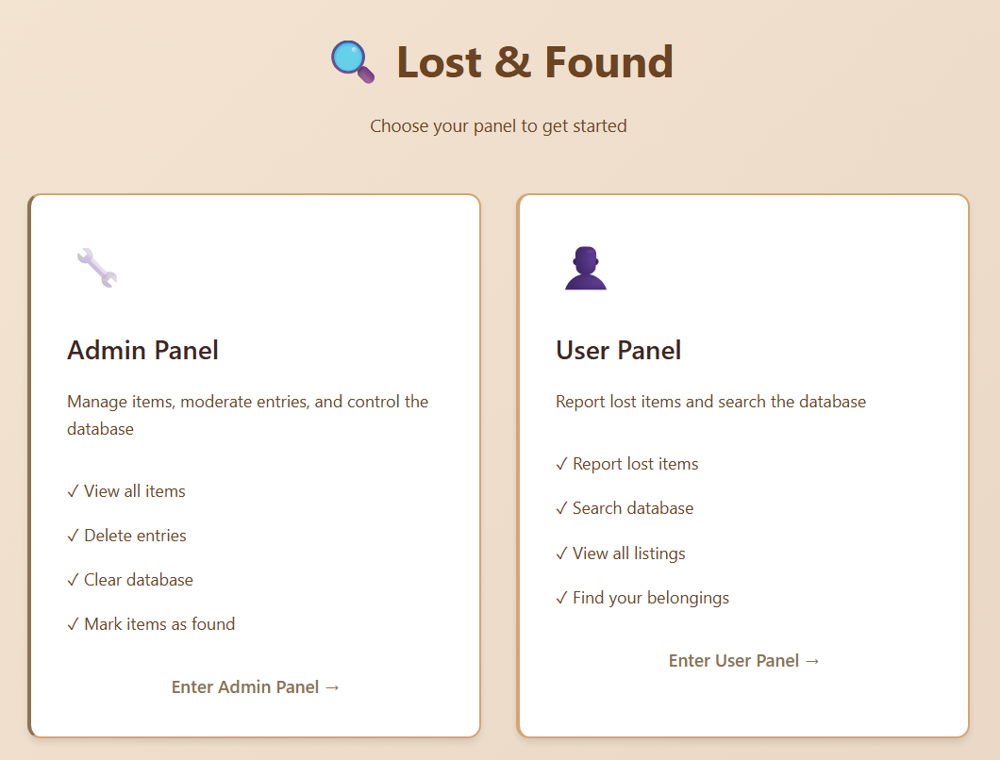
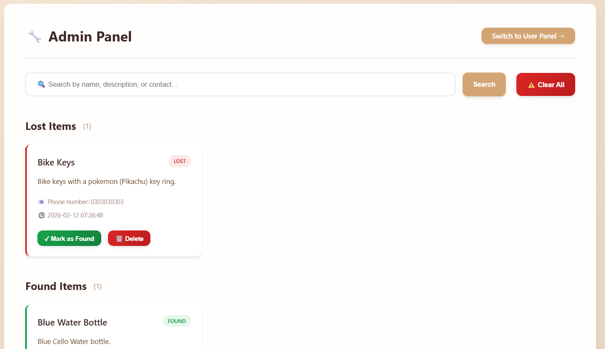
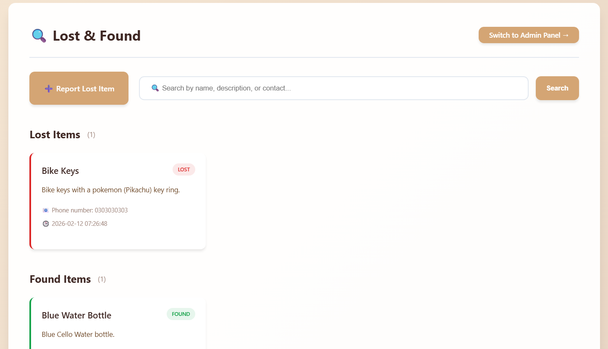
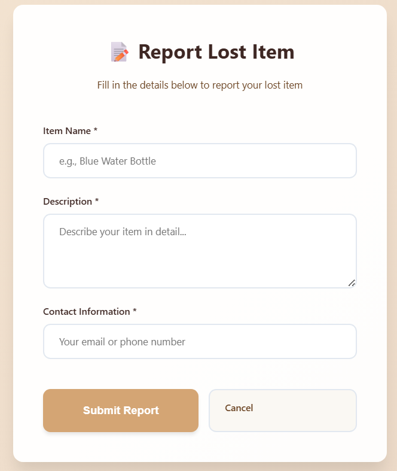

# Lost and Found Web App

A modern **Flask + SQLite** based web application with separate **Admin** and **User** panels to report, search, and manage lost & found items.

Designed for students, campus communities, or small organizations to track belongings easily.

---

## 🚀 Features

### 🔧 Admin Panel
-   **Search items** by name, description, or contact
-   **View all lost and found items** with item counts
-   **Delete individual items** with confirmation
-   **Mark items as found** (automatically records timestamp)
-   **Clear all database** (for testing/reset purposes)
-   **Role switching** - Switch to user panel anytime

### 👤 User Panel
-   **Report lost items** with name, description, and contact
-   **Search functionality** to find items
-   **View lost and found items** (read-only access)
-   **Modern add item form** with validation
-   **Role switching** - Switch to admin panel if needed

### 🎨 Modern UI Design
-   **Warm beige color theme** with minimalist aesthetics
-   **Clean card-based layouts** for better organization
-   **Flash message notifications** for user feedback
-   **Fully responsive** mobile-first design
-   **Simple, professional design** without distracting animations
-   **Empty state handling** with engaging visuals
-   **Session-based role management**

---

## 🛠️ Tech Stack

-   **Backend:** Python 3, Flask 3.1.2
-   **Database:** SQLite
-   **Frontend:** HTML5, Jinja2 templating, Vanilla CSS
-   **Session Management:** Flask sessions

---

## 📂 Project Structure

```
.
├── app.py                    # Main Flask application with routing
├── lostfound.db              # SQLite database (auto-created)
├── templates/                # HTML templates
│   ├── base.html            # Base layout with flash messages
│   ├── landing.html         # Role selection landing page
│   ├── admin_dashboard.html # Admin panel dashboard
│   ├── user_dashboard.html  # User panel dashboard
│   └── add_item.html        # Add new item form
├── static/                   # Static files
│   └── style.css            # Premium modern CSS design
├── requirements.txt          # Python dependencies
└── README.md                # Project documentation
```

---

## ⚙️ Installation & Setup

### 1. Clone the Repository

```bash
git clone https://github.com/KumarNayan11/Lost-found-app.git
cd Lost-found-app
```

### 2. Create a Virtual Environment (Optional but recommended)

```bash
python -m venv venv
source venv/bin/activate   # On Linux/Mac
venv\Scripts\activate      # On Windows
```

### 3. Install Dependencies

```bash
pip install -r requirements.txt
```

### 4. Run the Application

```bash
python app.py
```

The app will start at: **http://127.0.0.1:5000/**

---

## 📖 Usage Guide

### Landing Page

1. Visit **http://127.0.0.1:5000/**
2. Choose between **Admin Panel** or **User Panel**

### Admin Panel Features

**Access:** Click "Admin Panel" on landing page

-   **Search Items:** Use the search bar to filter by name, description, or contact
-   **View Items:** See all lost and found items separated by status
-   **Delete Items:** Click "🗑️ Delete" on any item (with confirmation)
-   **Mark as Found:** Click "✓ Mark as Found" to move items to found section
-   **Clear All:** Nuclear option to clear entire database (strong warning shown)
-   **Switch Role:** Click "Switch to User Panel →" in header

### User Panel Features

**Access:** Click "User Panel" on landing page

-   **Report Lost Item:** Click "➕ Report Lost Item" button
-   **Fill Form:** Enter item name, description, and contact info
-   **Search Items:** Use search bar to find specific items
-   **View Items:** Browse all lost and found items (read-only)
-   **Switch Role:** Click "Switch to Admin Panel →" in header

---

## 🌐 Routes

### Public Routes
```
GET  /                        Landing page (role selection)
GET  /set-role/admin          Set session to admin role
GET  /set-role/user           Set session to user role
```

### Admin Routes
```
GET  /admin                   Admin dashboard
POST /admin/delete/<id>       Delete specific item
POST /admin/clear             Clear all items from database
POST /admin/mark-found/<id>   Mark item as found
```

### User Routes
```
GET  /user                    User dashboard (view-only)
GET  /user/add                Add new item form
POST /user/add                Submit new lost item
```

---

## 💾 Database Schema

```sql
CREATE TABLE items (
    id INTEGER PRIMARY KEY AUTOINCREMENT,
    name TEXT NOT NULL,
    description TEXT NOT NULL,
    contact TEXT NOT NULL,
    status TEXT NOT NULL,           -- 'Lost' or 'Found'
    date_added TIMESTAMP DEFAULT CURRENT_TIMESTAMP,
    date_found TIMESTAMP NULL
);
```

---

## 🎨 UI Features

### Design Highlights

-   **Warm beige gradient** - Soft beige-to-tan background
-   **Minimalist card design** - Clean borders without heavy animations
-   **Professional aesthetic** - Simple, elegant design
-   **Subtle shadows** - Refined elevation system
-   **Flash notifications** - Auto-dismissing success/error messages
-   **Empty states** - Engaging visuals when no items exist
-   **Responsive grid** - Adapts from mobile to desktop seamlessly

### Color Palette

```css
Primary Beige:  #D4A574
Beige Dark:     #8B7355
Beige Light:    #F5E6D3
Accent Brown:   #6B4423
```

---

## 📱 Responsive Design

**Breakpoints:**
-   **Desktop:** > 768px (multi-column grid, side-by-side buttons)
-   **Tablet:** 768px - 480px (responsive grid)
-   **Mobile:** < 480px (single column, stacked buttons, touch-optimized)

All features work seamlessly across devices!

---

## 🔐 Security Features

-   ✅ **Parameterized SQL queries** - Prevents SQL injection
-   ✅ **Session-based access control** - Role management
-   ✅ **Input validation** - Required fields enforced
-   ✅ **Delete confirmations** - Prevents accidental deletions
-   ✅ **Flash message system** - User feedback for all actions

---

## 🚧 Future Enhancements

**Planned for v2.0:**
-   User authentication (login/registration)
-   Image upload for items
-   Location field (where item was lost/found)
-   Category field (Electronics, Clothing, etc.)
-   Email notifications
-   Pagination for large item lists
-   Admin moderation queue
-   Export to CSV
-   Statistics dashboard

---

## 🤝 Contributing

Pull requests are welcome! If you'd like to add features or fix issues, feel free to fork the repo and submit a PR.

**Development Setup:**
1. Fork the repository
2. Create a feature branch (`git checkout -b feature/amazing-feature`)
3. Commit your changes (`git commit -m 'Add amazing feature'`)
4. Push to the branch (`git push origin feature/amazing-feature`)
5. Open a Pull Request

---

## 📜 License

This project is open-source and available under the [MIT License](LICENSE).

---

## 📸 Screenshots

| Landing Page | Admin Panel | User Panel | Add Item Form |
|--------------|-------------|------------|---------------|
|  |  |  |  |

| Beautiful role selection with glassmorphism design | Full control with search, delete, and mark as found features | Clean interface for reporting and viewing items | Simple, focused form for reporting lost items |

---

## 👨‍💻 Author

**Nayan Jain**

-   GitHub: [@KumarNayan11](https://github.com/KumarNayan11)
-   Portfolio: [nayanjain.in](https://nayanjain.in)

---

## 🙏 Acknowledgments

-   Flask framework for the backend
-   Modern CSS design patterns for the UI
-   SQLite for simple and efficient data storage

---

<p align="center"> Made with ❤️ by <b>Nayan</b></p>
<p align="center">
  <a href="https://github.com/KumarNayan11/Lost-found-app">
    
  </a>
</p>
